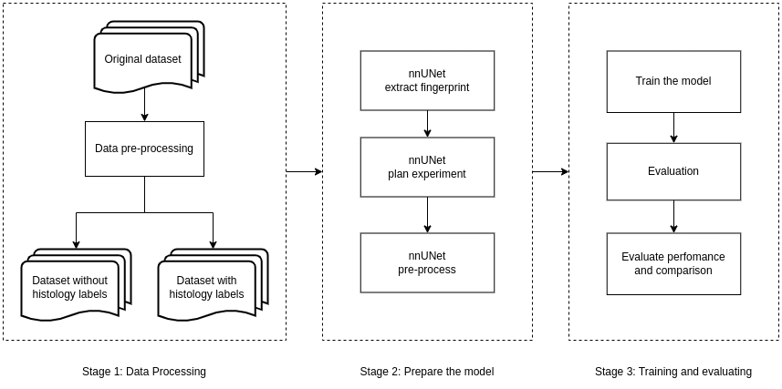

# Enhancing Kidney Lesion Segmentation through Histology-Specific Label Refinement and Classification

#### Project at [Fondazione Bruno Kessler (FBK)](https://www.fbk.eu/en/)

- Anh Tu Duong (aduong@fbk.eu)
- Hoai Thu Nguyen (thunh.bi12-432@st.usth.edu.vn)

---

## Description:

Kidney lesion segmentation plays a crucial role in diagnosing and planning the treatment of renal diseases. The [KiTS 2023 challenge](https://kits-challenge.org/kits23/) has provided a substantial dataset for developing and benchmarking segmentation algorithms. However, the challenge's initial scope, which treated all lesions as a single class, presents an opportunity for further refinement. With the availability of histological data for approximately half of the cases, this work proposes to enhance the granularity of lesion segmentation and explore its implications for lesion classification.

This research aims to demonstrate that incorporating histology-specific lesion labels can significantly enhance the granularity and accuracy of kidney lesion segmentation. It is anticipated that the refined segmentations will not only serve as a more detailed map for clinical analysis but also as a robust foundation for developing precise lesion classification algorithms. Moreover, this work is expected to establish a benchmark for future research in the domain, providing a baseline against which subsequent advancements can be measured.

## Objectives: 

- To pretrain a segmentation network, specifically the [nnUNet](https://github.com/MIC-DKFZ/nnUNet), on the KiTS 2023 challenge dataset, using the existing classification of background, healthy kidney tissue, and generic lesions.
- To refine the segmentation process by introducing histology-specific lesion labels, utilizing the newly available histological data.
- To evaluate the accuracy and specificity of the refined segmentation in comparison to the generic lesion segmentation.

