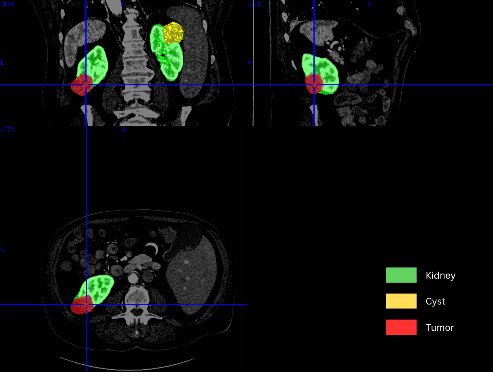

# Enhancing Kidney Lesion Segmentation through Histology-Specific Label Refinement and Classification

#### Thesis project at [University of Science and Technology of Hanoi (USTH)](https://usth.edu.vn/en) and [Fondazione Bruno Kessler (FBK)](https://www.fbk.eu/en/)

Hoai Thu Nguyen (thunh.bi12-432@st.usth.edu.vn)

---

## Description:
Recent advancements in medical imaging and machine learning have significantly improved the accuracy of automated lesion detection and segmentation. The [KiTS challenges](https://kits-challenge.org/kits23/) represents a pivotal step in this domain, focusing on the segmentation of kidney lesions from CT scans. This thesis proposal aims to build upon the challenge's foundation by introducing a novel approach that incorporates histology-specific labels for lesions, aiming to refine segmentation accuracy and serve as a precursor for detailed lesion classification.

Kidney lesion segmentation plays a crucial role in diagnosing and planning the treatment of renal diseases. The [KiTS 2023 challenge](https://kits-challenge.org/kits23/) has provided a substantial dataset for developing and benchmarking segmentation algorithms. However, the challenge's initial scope, which treated all lesions as a single class, presents an opportunity for further refinement. With the availability of histological data for approximately half of the cases, this work proposes to enhance the granularity of lesion segmentation and explore its implications for lesion classification.

This research aims to demonstrate that incorporating histology-specific lesion labels can significantly enhance the granularity and accuracy of kidney lesion segmentation. It is anticipated that the refined segmentations will not only serve as a more detailed map for clinical analysis but also as a robust foundation for developing precise lesion classification algorithms. Moreover, this work is expected to establish a benchmark for future research in the domain, providing a baseline against which subsequent advancements can be measured.

Building on the foundation of the KiTS 2023 challenge, this thesis proposal seeks to advance the field of kidney lesion segmentation and classification through the innovative use of histology-specific lesion labels. By enhancing the precision of segmentation models, this research holds the potential to contribute significantly to the diagnosis and treatment planning of renal diseases, marking a step forward in the application of machine learning techniques in medical imaging.

## Objectives: 

- To pretrain a segmentation network, specifically the [nnUNet](https://github.com/MIC-DKFZ/nnUNet), on the KiTS 2023 challenge dataset, using the existing classification of background, healthy kidney tissue, and generic lesions.
- To refine the segmentation process by introducing histology-specific lesion labels, utilizing the newly available histological data.
- To evaluate the accuracy and specificity of the refined segmentation in comparison to the generic lesion segmentation.
- If time permits, to modify and enhance the segmentation model based on initial outcomes and to establish a baseline for future developments in kidney lesion segmentation and classification.

## The tasks include: 

- This study will leverage the [nnUNet](https://github.com/MIC-DKFZ/nnUNet) framework, renowned for its comprehensive and adaptive approach to medical image segmentation. nnUNet automates several crucial steps in the segmentation process, including model selection, data preprocessing, augmentation, and post-processing, making it an ideal choice for efficiently handling the complexities of medical imaging data. The project will commence with the nnUNet framework being utilized to preprocess the KiTS 2023 challenge dataset and automatically select an appropriate neural network architecture for the task of segmenting background, healthy kidney tissue, and generic lesions.

- Subsequently, the project will innovate by adapting the nnUNet pipeline to incorporate histology-specific lesion labels into the segmentation process. This adaptation involves training the automatically selected network with a modified dataset that includes detailed lesion labels, leveraging nnUNet's capacity for efficient data augmentation and preprocessing tailored to the new segmentation task.

- The effectiveness of introducing histology-specific lesion segmentation will be evaluated through a series of performance metrics, such as accuracy, precision, recall, and the Dice coefficient, comparing the outcomes against the original segmentation task.

- Further exploration will be considered to enhance the nnUNet framework based on initial findings, including potential modifications to the network architecture, preprocessing, and data augmentation steps to improve segmentation accuracy and specificity for histology-specific lesions.